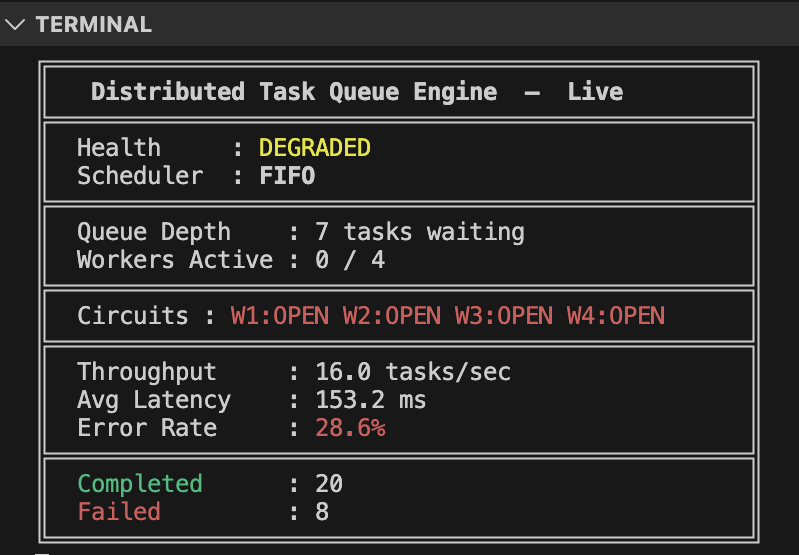

🔗 [View on GitHub](https://github.com/AsafCo2211/task-queue-engine)
# Distributed Task Queue Engine

> **C++20 · Docker · CLI Dashboard · Design Patterns · Microservices Architecture**

[](https://github.com/AsafCo2211/task-queue-engine/actions)

A production-inspired task queue engine built from scratch in C++20.  
The goal of this project is to demonstrate core software architecture skills through a real, running system — not a tutorial exercise.

---

## What Is This?

A **task queue engine** is the infrastructure layer that powers background work in real products.

When a photo is uploaded and needs to be processed, when an email needs to be sent, when a payment needs to go through — none of that blocks the original request. It is handed off to a background worker through a queue engine exactly like this one.

This project builds that engine from scratch: the thread-safe queue, the worker pool, the pluggable scheduler, the live monitoring dashboard, and the fault-tolerance layer — all wired together and running in Docker.

---

## Architecture

```
┌─────────────────────────────────────────────────────────────────────┐
│                        TaskQueueEngine                              │
│                                                                     │
│  [Producer A] ─────┐                  ┌──▶ [Worker 1] ──▶ CB        │
│  [Producer B] ─────┼──▶ [Broker]  ────┼──▶ [Worker 2] ──▶ CB        │
│  [Producer C] ─────┘    │             └──▶ [Worker 3] ──▶ CB        │
│                         │ Scheduler                   │             │
│                         │ (FIFO/Priority/RoundRobin)  │             │
│                                                       ▼             │
│                    [Monitor] ◀─── Observer ───────────┘             │
│                        │                                            │
│                    [CLI Dashboard]        [HealthChecker]           │
└─────────────────────────────────────────────────────────────────────┘
```

### Task Lifecycle

```
1. Producer calls broker.enqueue(task)
         ↓
2. Broker pushes to queue, wakes a sleeping Worker
         ↓
3. Scheduler selects which task goes next (FIFO / Priority / RoundRobin)
         ↓
4. Worker checks CircuitBreaker — allowed? execute : re-queue + sleep
         ↓
5. Worker executes task.payload() on its own thread
         ↓
6. Worker calls recordSuccess() or recordFailure() on CircuitBreaker
         ↓
7. Worker notifies all Observers (Monitor) via onTaskComplete()
         ↓
8. CLI Dashboard refreshes live stats every 500ms
```

---

## Design Patterns

Four patterns are implemented end-to-end, each solving a real architectural problem.

### 1. Producer / Consumer
**Problem:** The code that creates work should not know about the code that executes it — and vice versa.  
**Solution:** `TaskBroker` is the intermediary. Producers call `enqueue()`. Workers call `dequeue()`. Neither knows the other exists.  
**C++ mechanism:** `std::deque` + `std::mutex` + `std::condition_variable`. Workers sleep (zero CPU burn) until notified. Shutdown calls `notify_all()` so no thread stays blocked forever.

### 2. Strategy — Pluggable Scheduling
**Problem:** Different workloads need different scheduling algorithms without changing the rest of the system.  
**Solution:** `IScheduler` is a pure virtual interface. `TaskBroker` holds a `std::unique_ptr<IScheduler>`. Changing `scheduler_type` in `config.json` is the only change needed.

| Scheduler | Algorithm | Time complexity | Use case |
|-----------|-----------|-----------------|----------|
| `FifoScheduler` | First in, first out | O(1) | Fairness, predictability |
| `PriorityScheduler` | Highest priority first | O(n) | SLA-critical tasks |
| `RoundRobinScheduler` | Rotating index | O(1) | Even load distribution |

### 3. Observer — Decoupled Metrics
**Problem:** Workers should report results without knowing who is listening or how many listeners there are.  
**Solution:** `IObserver` interface with `onTaskComplete(TaskResult)`. `WorkerPool` holds a list of `IObserver*`. Adding a CSV logger, a Prometheus exporter, or an alert system requires zero changes to `Worker`.  
**C++ mechanism:** `std::shared_mutex` in `Monitor` — multiple Dashboard reads happen concurrently (shared lock), one Worker write locks exclusively.

### 4. Circuit Breaker — Fault Tolerance
**Problem:** A failing worker that keeps retrying can cascade and bring down the whole system.  
**Solution:** Each Worker owns a `CircuitBreaker` instance with three states:

```
        X consecutive failures
CLOSED ──────────────────────▶ OPEN
  ▲                              │
  │     probe succeeded          │  recovery timeout elapsed
  │                              ▼
  └──────────────────────── HALF_OPEN
        probe failed ──▶ OPEN (again)
```

When `OPEN`, the Worker re-queues the task and sleeps — another Worker can pick it up. The circuit recovers automatically after a configurable timeout.

---

## Component Map

| File | Responsibility |
|------|----------------|
| `Task.hpp` | Unit of work: id, priority, `std::function<void()>` payload, status, timestamp |
| `TaskResult.hpp` | Output struct: success/failure, latency, worker id — passed to Observers |
| `TaskBroker.hpp` | Thread-safe queue with backpressure, shutdown, and pluggable scheduler |
| `IScheduler.hpp` | Strategy interface: `next(deque<Task>&) → Task` |
| `FifoScheduler.hpp` | O(1) front-pop |
| `PriorityScheduler.hpp` | O(n) max_element scan |
| `RoundRobinScheduler.hpp` | O(1) rotating counter |
| `SchedulerFactory.hpp` | Factory: string → `unique_ptr<IScheduler>` |
| `Worker.hpp` | Background thread: dequeue → CB check → execute → notify |
| `WorkerPool.hpp` | RAII lifecycle for N Workers, circuit state summary |
| `IObserver.hpp` | Observer interface: `onTaskComplete(TaskResult)` |
| `Monitor.hpp` | Sliding-window metrics: throughput, latency, error rate |
| `CLIDashboard.hpp` | ANSI terminal UI, refreshes every 500ms on its own thread |
| `CircuitBreaker.hpp` | CLOSED / OPEN / HALF_OPEN state machine, mutex-protected |
| `HealthChecker.hpp` | Writes UP / DEGRADED / DOWN to `/tmp/health` — Docker reads this |
| `Config.hpp` | Loads `config.json`, validates, supports ENV variable overrides |

---

## Key Design Decisions

**`std::function<void()>` as Task payload**  
Type erasure — the broker stores tasks without knowing what code is inside. Any callable (lambda, functor, free function) fits in the same queue without templating the entire system.

**`std::deque` instead of `std::queue`**  
`PriorityScheduler` and `RoundRobinScheduler` need random access to reorder tasks. `std::queue` only exposes `front()`/`pop()`. `std::deque` gives full iterator access while remaining efficient.

**`mutex` + `condition_variable` (not lock-free)**  
Workers sleep via `cv_.wait()` — zero CPU when the queue is empty. Lock-free queues require complex memory ordering guarantees; the added complexity is not justified for this scale.

**`unique_ptr<Worker>` in WorkerPool**  
`Worker` is non-movable: it holds a reference member (`broker_`) and an `atomic<bool>` (`busy_`). Storing raw pointers in a vector would be unsafe. `unique_ptr` gives stable addresses — the Worker never moves in memory while its thread is alive.

**Config-driven, ENV-overridable**  
No hardcoded values anywhere. `config.json` is the base. ENV variables override at startup — used by `docker-compose.yml` to inject `NUM_WORKERS`, `SCHEDULER_TYPE`, etc. without recompiling. Follows 12-Factor App methodology.

**Health via file, not HTTP**  
Docker's `HEALTHCHECK CMD` reads `/tmp/health` directly — no web server needed. `HealthChecker` writes `UP`, `DEGRADED`, or `DOWN` every 5 seconds. Simple, reliable, zero dependencies.

**RAII everywhere**  
`Worker` starts its thread in the constructor, joins in the destructor. `WorkerPool`'s destructor calls `shutdown()` as a safety net. Resources cannot leak regardless of how the caller exits.

---

## Live CLI Dashboard



Color coding: Health green (UP) / yellow (DEGRADED) / red (DOWN). Error rate and OPEN circuits highlighted in red.

---

## Build & Run

**Prerequisites:** cmake 3.20+, g++ 13+, git

```bash
git clone https://github.com/YOUR_USERNAME/task-queue-engine.git
cd task-queue-engine

mkdir build && cd build
cmake ..          # downloads nlohmann/json + GoogleTest via FetchContent
make -j$(nproc)
cd ..

./build/TaskQueue
```

The demo runs three phases automatically:
1. **Normal load** — all circuits CLOSED, health UP (green)
2. **Failure burst** — circuits trip to OPEN, health DEGRADED (yellow)
3. **Recovery** — circuits return to CLOSED, health back to UP (green)

---

## Configuration

All parameters live in `config/config.json`. No hardcoded values in code.

```json
{
    "num_workers": 4,
    "queue_capacity": 1000,
    "scheduler_type": "fifo",
    "task_timeout_ms": 150,
    "shutdown_timeout_ms": 10000,
    "circuit_breaker": {
        "failure_threshold": 2,
        "recovery_timeout_s": 3
    },
    "monitor": {
        "refresh_interval_ms": 500,
        "window_size_s": 30
    },
    "health_check": {
        "interval_s": 5,
        "status_file": "/tmp/health"
    }
}
```

**ENV overrides** (take precedence over JSON — used by Docker):

| Variable | Config key |
|----------|------------|
| `NUM_WORKERS` | `num_workers` |
| `SCHEDULER_TYPE` | `scheduler_type` |
| `QUEUE_CAPACITY` | `queue_capacity` |
| `TASK_TIMEOUT_MS` | `task_timeout_ms` |

---

## Docker

```bash
cd docker
docker-compose up --build
```

The container is built in two stages (multi-stage build):
- **Stage 1 (builder):** `gcc:13` — compiles the project with cmake
- **Stage 2 (runtime):** `gcc:13` — runs only the binary

Docker health check polls `/tmp/health` every 5 seconds:

```bash
docker ps                        # shows: healthy / unhealthy
docker logs task-queue-engine    # shows dashboard output
```

---

## Tests

39 unit tests across 4 suites, using GoogleTest (downloaded via FetchContent — no manual install):

```bash
cd build && ctest --output-on-failure
```

| Suite | Tests | What is covered |
|-------|-------|-----------------|
| `BrokerTest` | 9 | enqueue/dequeue, backpressure, shutdown, concurrent safety |
| `FifoSchedulerTest` | 3 | insertion order, priority ignored |
| `PrioritySchedulerTest` | 3 | highest priority first, ties, multi-call order |
| `RoundRobinSchedulerTest` | 2 | rotation, removal from deque |
| `SchedulerFactoryTest` | 4 | all types created correctly, unknown type throws |
| `CircuitBreakerTest` | 10 | all state transitions, recovery, thread safety |
| `WorkerPoolTest` | 8 | spawn, execute, failed tasks, multiple observers, shutdown |

```
100% tests passed, 0 tests failed out of 39
```

---

## CI/CD

GitHub Actions runs automatically on every push to `main`:

```
git push → checkout → install cmake/g++ → cmake .. → make → ctest
```

The pipeline runs on `ubuntu-latest` — matching the target production environment.

---

## Why This Project Demonstrates Architecture Thinking

> *"I built a Distributed Task Queue Engine in C++20 from scratch. The design is based on four patterns: Producer/Consumer for decoupling producers from workers, Strategy for swapping scheduling algorithms at runtime via config, Observer for collecting metrics without touching Worker code, and Circuit Breaker for protecting against cascading failures. The engine starts with a single docker-compose command, displays a live CLI dashboard, and is covered by 39 unit tests with CI on GitHub Actions."*

| Question | This project answers it because... |
|----------|-------------------------------------|
| "Explain Producer/Consumer" | Implemented from scratch: CV, mutex, backpressure, graceful shutdown |
| "What is the Strategy pattern?" | 3 schedulers swap via config — zero changes to Broker or Workers |
| "What is the Observer pattern?" | Worker notifies Monitor with no direct coupling. New listener = one line |
| "What is Circuit Breaker?" | Full CLOSED/OPEN/HALF_OPEN state machine with automatic recovery |
| "mutex vs condition_variable?" | mutex protects data. CV lets threads wait for an event without burning CPU |
| "What is RAII?" | Worker starts thread in ctor, joins in dtor. Pool destructs as safety net |
| "What is backpressure?" | `enqueue()` returns `false` when queue is full — producer handles rejection |
| "What is graceful shutdown?" | Workers finish current task, then exit cleanly. No tasks are lost |
| "Why unique_ptr for Workers?" | Worker is non-movable (reference + atomic members). Pointer stays stable |
| "Why Docker?" | Reproducible environment. One command, runs identically everywhere |
| "How do you monitor a system?" | Live throughput, latency, error rate, circuit state — refreshed every 500ms |

---

## Milestones

| # | Description | Status |
|---|-------------|--------|
| 0 | Scaffold: CMake, .gitignore, config skeleton | ✅ |
| 1 | Core: Task, TaskBroker, Worker — Producer/Consumer pattern | ✅ |
| 2 | Config loader (nlohmann/json) + WorkerPool RAII | ✅ |
| 3 | Strategy pattern: IScheduler + FIFO / Priority / RoundRobin | ✅ |
| 4 | Observer pattern: Monitor + live CLI Dashboard | ✅ |
| 5 | Circuit Breaker per Worker: CLOSED / OPEN / HALF_OPEN | ✅ |
| 6 | Docker multi-stage build + HealthChecker + docker-compose | ✅ |
| 7 | 39 GoogleTest unit tests + GitHub Actions CI | ✅ |
